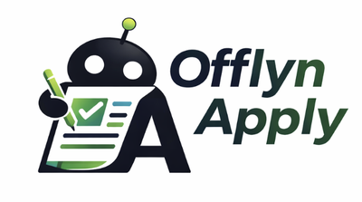

<div align="center">
  
  <h3>Privacy-first job application assistant for Chrome & Firefox</h3>
  <p>Auto-fill forms · AI cover letters · Local Ollama · Zero cloud · Zero tracking</p>

  <p>
    <a href="https://github.com/joelnishanth/offlyn-apply/blob/main/LICENSE">
      
    </a>
    
    
    
    
    
  </p>

  <p>
    <a href="https://chromewebstore.google.com/detail/offlyn-apply-job-applicat/bjllpojjllhfghiemokcoknfmhpmfbph"><strong>Get for Chrome</strong></a> ·
    <a href="https://addons.mozilla.org/en-US/firefox/addon/offlyn-apply/"><strong>Get for Firefox</strong></a> ·
    <a href="https://joelnishanth.github.io/offlyn-apply"><strong>Website</strong></a> ·
    <a href="#getting-started"><strong>Quick Start</strong></a> ·
    <a href="CONTRIBUTING.md"><strong>Contributing</strong></a> ·
    <a href="https://github.com/joelnishanth/offlyn-apply/issues/new/choose"><strong>Report a Bug</strong></a>
  </p>

  <br/>

  

</div>

---

## What It Does

Offlyn Apply detects job application forms on sites like Workday, Greenhouse, Lever, and plain HTML forms, then fills them out automatically using your stored profile. Everything runs locally via [Ollama](https://ollama.com) — no cloud, no API keys, no data sent anywhere.

| Feature | Description |
|---|---|
| **Smart Auto-Fill** | Detects all form fields and fills them from your profile in seconds |
| **AI Cover Letters** | Generates tailored cover letters using a local Ollama model |
| **Application Tracker** | Kanban dashboard to track every application from submitted to offer |
| **100% Private** | All data in `browser.storage.local` — no backend, no sync, no cloud |
| **ATS Detection** | Identifies Workday, Greenhouse, Lever, and 50+ other ATS systems |
| **Learns From You** | Reinforcement learning improves autofill accuracy from your corrections |

---

## Screenshots

<div align="center">
  <table>
    <tr>
      <td align="center" width="33%">
        <br/>
        <sub><b>Extension Popup</b><br/>One-click auto-fill & cover letter</sub>
      </td>
      <td align="center" width="33%">
        <br/>
        <sub><b>Compatibility Score</b><br/>AI-powered skills & salary match</sub>
      </td>
      <td align="center" width="33%">
        <br/>
        <sub><b>Profile Onboarding</b><br/>8-step guided setup from your resume</sub>
      </td>
    </tr>
  </table>
</div>

---

## Requirements

- **Chrome** or **Firefox** 109+
- **Node.js** 18+
- **[Ollama](https://ollama.com)** running locally with a model pulled (e.g. `llama3.2`)

---

## Getting Started

### 1. Clone the repo

```bash
git clone https://github.com/joelnishanth/offlyn-apply.git
cd offlyn-apply/apps/extension-firefox
```

### 2. Install dependencies

```bash
npm install
```

### 3. Start Ollama

```bash
ollama serve
ollama pull llama3.2
```

### 4. Build the extension

```bash
npm run build
```

### 5. Load in Firefox

```bash
npm run run:firefox
```

Or load manually: open `about:debugging` → "This Firefox" → "Load Temporary Add-on" → select `dist/manifest.json`.

---

## Project Structure

```
offlyn-apply/
├── apps/
│   ├── extension-chrome/         # Chrome extension (Manifest V3)
│   │   ├── src/
│   │   └── package.json
│   └── extension-firefox/        # Firefox extension (Manifest V3)
│       ├── src/
│       │   ├── background.ts     # Service worker / background script
│       │   ├── content.ts        # Content script (injected into pages)
│       │   ├── popup/            # Popup UI
│       │   ├── onboarding/       # First-run onboarding flow
│       │   ├── dashboard/        # In-page job tracker
│       │   ├── settings/         # Settings page
│       │   └── shared/           # AI clients, autofill logic, utilities
│       └── package.json
├── assets/                       # Logo and screenshots
├── CONTRIBUTING.md
├── CODE_OF_CONDUCT.md
├── SECURITY.md
├── LICENSE
└── index.html                    # GitHub Pages landing page
```

---

## Development

| Command | Description |
|---|---|
| `npm run build` | Production build to `dist/` |
| `npm run dev` | Watch mode — rebuilds on file changes |
| `npm run run:firefox` | Build + launch Firefox with extension loaded |
| `npm test` | Run unit tests (Vitest) |
| `npm run test:watch` | Tests in watch mode |

---

## Privacy Architecture

All data stays on your machine. The extension only makes network requests to `localhost` (Ollama).

```
Your Browser (local storage)
    ├── Profile data (resume, personal info)
    ├── Application history
    └── Learned corrections

localhost:11434 (Ollama)
    └── Cover letter generation
        └── Model runs entirely on your hardware

No external servers. No analytics. No telemetry.
```

---

## Contributing

Contributions are welcome — bug fixes, new ATS integrations, better form detection, UI improvements. Please read [CONTRIBUTING.md](CONTRIBUTING.md) before opening a pull request.

**Good first issues:** look for the [`good first issue`](https://github.com/joelnishanth/offlyn-apply/labels/good%20first%20issue) label.

---

## Security

If you discover a security vulnerability, please follow the responsible disclosure process in [SECURITY.md](SECURITY.md) rather than opening a public issue.

---

## License

[MIT](LICENSE) — © 2026 [Joel Nishanth](https://offlyn.ai)
